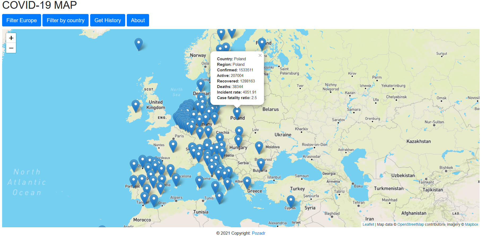
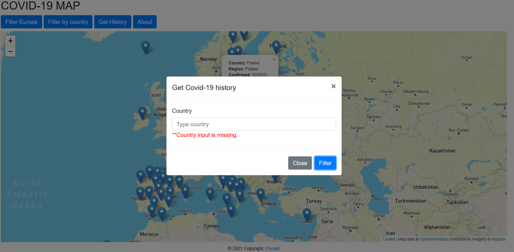
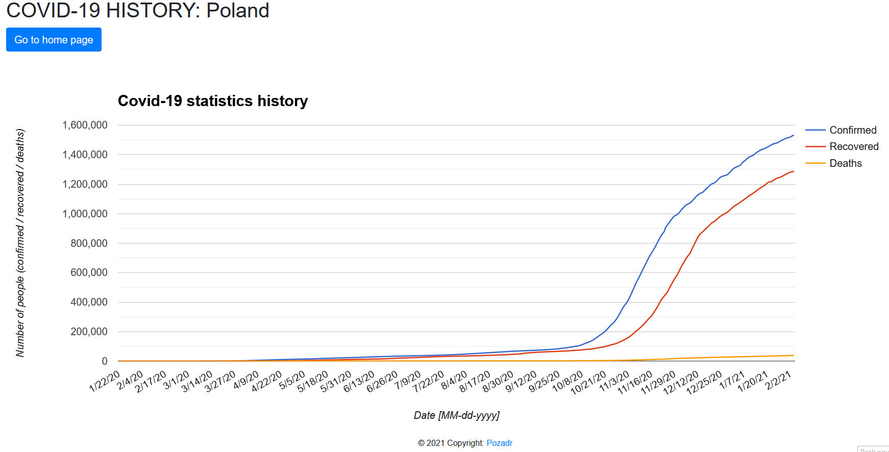

# Map_Covid_19

## General
Visualisation of COVID-19 data from [Johns Hopkins University.](https://github.com/CSSEGISandData/COVID-19)
The data is updated automatically every day as data for the previous day. If Johns Hopkins University has not updated 
the previous day's data, then the data taken two days ago is downloaded.
User can show  statistic of a country or all European countries on a map. There is also a feature to visualise
historical data on a chart. The application uses [Mapbox service](https://account.mapbox.com) to display the map. Use the 
[Leaflet](https://leafletjs.com) to add markers with a description on the map.
[Google charts.](https://developers.google.com/chart/) were used to draw a graph from the downloaded data.

### Demo
https://covid-19-map-app.herokuapp.com/map

### Endpoint to run application locally
    localhost:8080/map

## Configuration
application.properties file:

    api-token= <https://account.mapbox.com>

## Technologies
- Java 11
- Maven
- Spring Boot 2.4.0
- Thymeleaf
- Bootstrap(CSS)
- JQuery/JavaScript
- Leaflet
- Google Charts

## Screenshots

